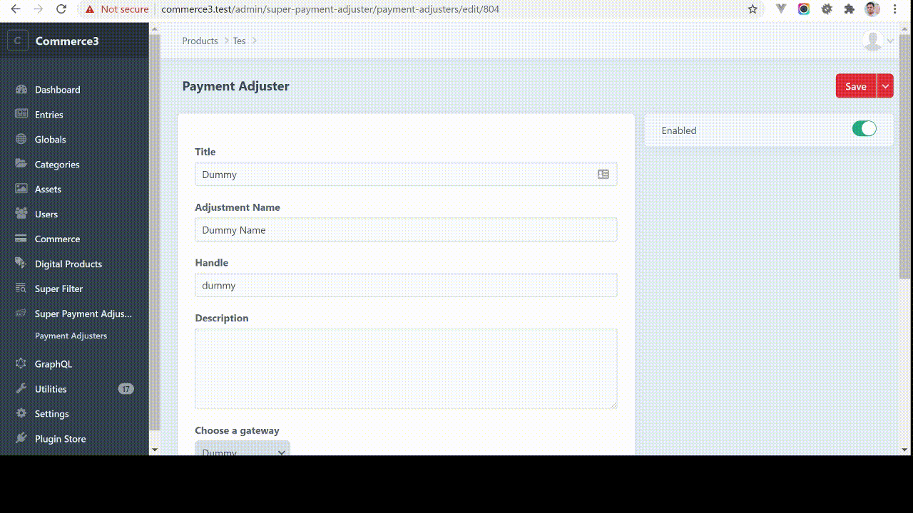

# Super Payment Adjuster for Craft CMS 3.x

Adds ability to adjust order amount based on the payment method selected.



## Features
- Adds ability to adjust order amount based on the payment method selected.

- The plugin allows you to add multiple adjustment for different payment gateways. 
  

- Allows you to choose adjustment types which are discount, shipping and tax for your payment adjustment.
  

- Allows you to add or deduct cost based on amount type which are flat amount or percentage off from the order total.


## Installation

To install the plugin, follow these instructions.

1. Open your terminal and go to your Craft project:

       cd /path/to/project  

2. Then tell Composer to load the plugin:

       composer require pdaleramirez/super-payment-adjuster  

3. In the Control Panel, go to Settings -> Plugins and click the “Install” button for Super Payment Adjuster.
4. Go to Super Payment Adjuster -> Payment Adjust  and click **New Payment Adjuster** button  to start adding payment adjuster.

## Template

Once you added your payment adjusters, you can call the order adjustments in the twig template 
like how the example template does it.
E.g.
```
<ul>
      
      <li>Adjustment Name: {{ adjustment.name }}</li>
      
      <li>Description: {{ adjustment.description }}</li>
      
      <li>Type: {{ adjustment.type }}</li>
      
      <li>Amount: {{ adjustment.amount }}</li> 
   
</ul>
```

Contact me for inquiries or if you require more customization. <dalefirstpage@gmail.com>
